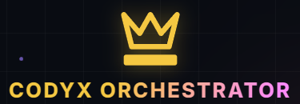
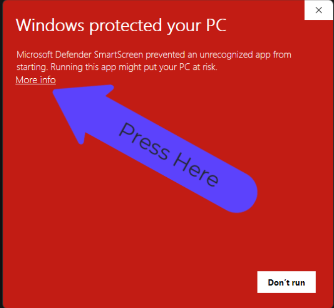
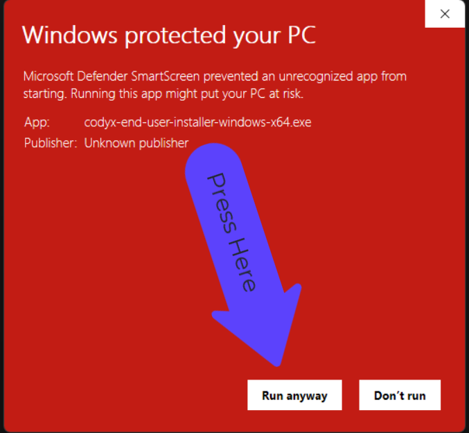

<p align="center">
  
  
  
  
</p>

<h1 align="center">CODYX-ORCHESTRATOR</h1>
<p align="center"><strong>Local-first AI coding agent. CLI, TUI, web UI, and 20+ providers — one tool to rule them all.</strong></p>

codyx is an open-source AI coding agent that runs entirely on your machine. It combines a
full-featured terminal UI, a headless API server, and a web dashboard into a single binary.
Connect any AI provider, manage sessions and projects, automate infrastructure, and extend
everything through plugins, agents, and custom tools.

---

## Why codyx?

Most AI coding tools are either SaaS-locked (your code leaves your machine), CLI-only (no UI),
or single-provider. codyx is different:

|                       | codyx  | GitHub Copilot CLI | Claude Code  | Aider     |
| --------------------- | ------ | ------------------ | ------------ | --------- |
| **Local-first**       | ✅     | ❌ SaaS-dependent  | ❌ API-only  | ✅        |
| **Terminal UI**       | ✅     | ❌                 | ✅           | ❌        |
| **Web UI**            | ✅     | ❌                 | ❌           | ❌        |
| **Multi-provider**    | ✅ 20+ | ❌ Copilot only    | ❌ Anthropic | ❌ OpenAI |
| **Multi-user server** | ✅     | ❌                 | ❌           | ❌        |
| **Plugin system**     | ✅     | ❌                 | ❌           | ❌        |
| **Infra tools**       | ✅     | ❌                 | ❌           | ❌        |
| **Open source**       | ✅ MIT | ❌                 | ❌           | ✅ Apache |

---

## Installation & Setup

Choose the installation method that fits your environment:

### 1. Windows End-User Installer (Recommended For Normal Users)

[](https://github.com/mufasa1611/codyx-orchestrator/releases/latest/download/codyx-installer-launcher-windows-x64.exe)

Downloads the latest release of `codyx-installer-launcher-windows-x64.exe` automatically. It installs from compiled release assets only: no Git install, no Bun install, and no source checkout. The installed `codyx` shims perform a quiet release-manifest check on every start, update the compiled CLI when a newer asset is available, then launch the same TUI/Web UI commands.

<p align="center">
  <a href="https://install.kingkung.men/downloads">
    
  </a>
  <br />
  <samp>
    <b><a href="https://install.kingkung.men/downloads">👉 Click here to visit the Downloads Page</a></b>
  </samp>
</p>

> [!IMPORTANT]
> **Windows SmartScreen Bypass Guide**
>
> Because raw downloads and installer binaries are unsigned, Windows SmartScreen may show a **"Windows protected your PC"** popup.
>
> To proceed and install:
>
> 1. Click on **More info** (as shown in Step 1).
> 2. Click the **Run anyway** button that appears (as shown in Step 2).
>
>  &nbsp;
> 

### 2. Global npm Package (Recommended If Node.js Is Installed)

If you already have Node.js and npm installed, simply run:

```bash
npm install -g codyx-ai@beta && codyx
```

To update the package later, run `npm install -g codyx-ai@beta`.

### 3. Windows Source Launcher (Developer / Power User)

If you intentionally want a self-updating source checkout, download `codyx-launcher-windows-x64.exe` from the GitHub Release.

This launcher installs Git/Bun when needed, keeps a slim source checkout under the user's profile, and rebuilds when source updates arrive. It is useful for testers and developers, but normal users should prefer the compiled end-user installer above.

### 4. Windows One-Click npm Installer (Without Node.js)

If you do not have Node.js or npm installed, run this PowerShell command to automatically install all dependencies via `winget` and configure codyx:

```powershell
& ([scriptblock]::Create((irm https://raw.githubusercontent.com/mufasa1611/codyx-orchestrator/dev/script/install-npm.ps1))) -Tag beta -Launch
```

Or from Command Prompt:

```cmd
powershell.exe -NoProfile -ExecutionPolicy Bypass -Command "& ([scriptblock]::Create((irm https://raw.githubusercontent.com/mufasa1611/codyx-orchestrator/dev/script/install-npm.ps1))) -Tag beta -Launch"
```

### 5. Headless Server (Docker)

To deploy a backend server or host codyx for a team:

```bash
docker run -p 4097:4097 ghcr.io/mufasa1611/codyx-orchestrator:latest
```

### 6. From Source (Development)

If you want to modify code or run an editable development checkout:

```bash
git clone https://github.com/mufasa1611/codyx-orchestrator.git
cd codyx-orchestrator
bun install
bun run dev
```

> [!IMPORTANT]
> The source checkout is Bun-only. Do not run `npm install` inside the source folder. This monorepo utilizes Bun workspaces, Bun catalogs, and specific workspace dependency protocols that npm does not support.

---

## Interfaces

| Surface     | Command                   | Best For                                                      |
| ----------- | ------------------------- | ------------------------------------------------------------- |
| Terminal UI | `codyx`                   | Daily interactive coding, sessions, providers, and agents     |
| CLI         | `codyx run "..."`         | Scripting, CI jobs, one-shot automation, and repeatable tasks |
| API server  | `codyx serve --port 4097` | Headless or team deployments with auth and web clients        |
| Web UI      | `codyx web`               | Browser-based session and provider management                 |

## Features

### Three Interfaces, One Backend

- **TUI** — Full-screen terminal UI with themes, keybindings, multi-session tabs, dialog
  system, and scrollback. Built with `@opentui/solid`.
- **CLI** — 30+ subcommands for scripting, automation, and CI/CD pipelines. Parseable output,
  pipe-friendly.
- **Web UI** — Browser-based dashboard at `http://localhost:4097`. Session viewer, provider
  management, user admin. Built with SolidJS + Vite.

### 20+ AI Providers

OpenAI · Anthropic · Google Gemini · Google Vertex · AWS Bedrock · Azure OpenAI ·
Groq · Mistral · Perplexity · Together AI · DeepInfra · xAI (Grok) · Cerebras ·
Alibaba (Qwen) · GitHub Copilot · OpenRouter · GitLab Duo AI · Venice AI ·
Cloudflare AI Gateway · Ollama (local) · llama.cpp (local)

Switch between providers per-session or per-command. No vendor lock-in.

### Agent System

Pluggable agents with permission boundaries, custom tools, and skill definitions:

| Agent              | Purpose                               |
| ------------------ | ------------------------------------- |
| `operator`         | General-purpose coding and automation |
| `infra-audit`      | Read-only infrastructure inspection   |
| `windows-admin`    | Windows system diagnostics            |
| `ssh-operator`     | Remote host inspection over SSH       |
| `docker-operator`  | Docker container and image inspection |
| `systemd-operator` | Linux systemd service audit           |
| `proxmox-operator` | Proxmox VM/container inventory        |
| `backup-operator`  | Backup file inventory and checksum    |
| `web-research`     | Web search and source-backed research |

### Multi-User Server

Built-in authentication (JWT, OpenAuth), per-user sessions, role-based access, and
rate limiting. Run `codyx serve` to start the headless API server — your team connects
through the web UI or the CLI.

### Project & Session Management

- Multi-workspace with VCS-aware context
- Per-project configuration and state
- Persistent sessions with undo, retry, compaction, and structured output
- Event-sourced sync across devices
- Export and import sessions between instances

### MCP / ACP Support

Model Context Protocol and Agent Client Protocol for interoperable tool ecosystems.
Connect MCP servers, expose local tools, and integrate with the broader AI tooling landscape.

### Plugin System

Three extension surfaces:

- **npm plugins** — Full plugins published to npm
  - **Local tools** — .cody/{tool,tools}/\*.{ts,js} scripts loaded as CLI tools
  - **Local plugins** — .cody/{plugin,plugins}/\*.{ts,js} for system extensions
  - **Agent definitions** — .cody/{agent,agents}/\*_/_.md for custom agent configurations

### Private by Default

- **Private project data** — Codyx does not collect your code, prompts, conversations, or project content. After email verification succeeds, the official Windows installer records the display name and verified email address you provide and sends an operational registration notice to the Codyx administrator. The notice never contains the verification code. The display name is not independently verified, the data is not used for marketing, and deletion can be requested at `privacy@kingkung.men`; see [the installer privacy notice](https://install.kingkung.men/privacy). Manual clones and repository downloads are not tracked by this installer service.
- **No cloud dependency** — Works fully offline with local models (Ollama, llama.cpp)
- **Local database** — All sessions, config, and state stored in local SQLite
- **Self-contained** — Single binary with no external service requirements

---

## CLI Commands

| Command             | Category            | Description                                                  |
| :------------------ | :------------------ | :----------------------------------------------------------- |
| `codyx`             | Core / UI           | Launches the interactive Terminal UI (TUI)                   |
| `run`               | Core / UI           | Executes a one-shot query or task from the command line      |
| `serve`             | Core / UI           | Starts a headless Codyx background HTTP API server           |
| `web`               | Core / UI           | Launches the local Web UI server                             |
| `setup`             | Setup & Config      | Runs the first-time setup wizard for configurations          |
| `doctor`            | Maintenance & Debug | Diagnoses environment and installation health                |
| `uninstall`         | Maintenance & Debug | Uninstalls Codyx and cleans up related files                 |
| `upgrade`           | Maintenance & Debug | Updates Codyx CLI/launcher to the latest version             |
| `providers`         | Setup & Config      | Manages AI provider setups (Ollama, Gemini, OpenAI)          |
| `models`            | Setup & Config      | Lists available models from active AI providers              |
| `mcp`               | Setup & Config      | Manages Model Context Protocol (MCP) server integrations     |
| `acp`               | Setup & Config      | Manages Agent Connection Protocol (ACP) integrations         |
| `plugin`            | Setup & Config      | Installs, updates, and configures system plugins             |
| `agent`             | Data & Workspaces   | Runs a specific agent definition (`operator`, `infra-audit`) |
| `session`           | Data & Workspaces   | Lists, views, and deletes session history                    |
| `export` / `import` | Data & Workspaces   | Transfers active chat sessions between machines              |
| `stats`             | Data & Workspaces   | Shows local AI token and API usage statistics                |
| `users`             | Setup & Config      | Manages server users in multi-user environments              |
| `github` / `pr`     | Data & Workspaces   | Integrates with GitHub issues and pulls PR workflows         |
| `debug`             | Maintenance & Debug | Debug tools (LSP diagnostics, ripgrep, snapshot helper)      |

### TUI Chat Slash Commands

These slash commands can be typed directly into the TUI prompt text field during an active chat session.

| Command        | Category | Aliases                | Description                                                                          |
| :------------- | :------- | :--------------------- | :----------------------------------------------------------------------------------- |
| `/sessions`    | Session  | `/resume`, `/continue` | Opens the session list switcher to browse or switch active chat logs                 |
| `/new`         | Session  | `/clear`               | Cleans up the workspace and starts a new session                                     |
| `/editor`      | Session  | -                      | Opens an external text editor (Notepad, VS Code, etc.) to write complex prompts      |
| `/warp`        | Session  | -                      | Shifts the session to a different workspace (if experimental workspaces are enabled) |
| `/permissions` | System   | -                      | Sets the permission level standard: `restricted`, `standard`, or `full`              |
| `/models`      | Agent    | -                      | Opens the AI model selection manager dialog                                          |
| `/agents`      | Agent    | -                      | Opens the agent selector dialog to swap role definitions                             |
| `/mcps`        | Agent    | -                      | Opens the Model Context Protocol (MCP) server checklist                              |
| `/variants`    | Agent    | -                      | Toggles/switches selected provider model variant configurations                      |
| `/connect`     | Provider | -                      | Opens the developer AI provider credential configuration wizard                      |
| `/org`         | Provider | `/orgs`, `/switch-org` | Switches connected organizations (in multi-org setups)                               |
| `/status`      | System   | -                      | Displays active system and connection health details                                 |
| `/themes`      | System   | -                      | Opens the theme switcher dialog to change layout colors                              |
| `/skills`      | Prompt   | -                      | Opens custom rules and guideline checklist (Codyx Skills)                            |
| `/help`        | System   | -                      | Displays the TUI cheat-sheet help overlay                                            |
| `/exit`        | System   | `/quit`, `/q`          | Closes and exits the Codyx terminal interface                                        |

### Usage Examples

```bash
# One-shot task
codyx run "explain this project structure"

# Start server for team access
codyx serve --port 4097

# Use a specific agent
codyx agent infra-audit

# List all available models
codyx models

```

---

## Architecture

```mermaid
flowchart TB
    classDef interface fill:#6366f1,color:#fff,stroke:#4f46e5,stroke-width:2px
    classDef gateway fill:#0ea5e9,color:#fff,stroke:#0284c7,stroke-width:2px
    classDef core fill:#8b5cf6,color:#fff,stroke:#7c3aed,stroke-width:2px
    classDef data fill:#10b981,color:#fff,stroke:#059669,stroke-width:2px
    classDef external fill:#f59e0b,color:#fff,stroke:#d97706,stroke-width:2px,stroke-dasharray:5 3
    classDef infra fill:#ec4899,color:#fff,stroke:#db2777,stroke-width:2px

    subgraph Interfaces ["🎨 User Interfaces"]
        TUI["Terminal UI<br/><small>@opentui/solid</small>"]:::interface
        CLI["CLI<br/><small>yargs · 30+ commands</small>"]:::interface
        WEB["Web UI<br/><small>SolidJS + Vite</small>"]:::interface
    end

    subgraph Gateway ["🌐 Gateway"]
        HONO["Hono HTTP API<br/><small>port 4097 · OpenAPI</small>"]:::gateway
        WS["WebSocket<br/><small>session streams</small>"]:::gateway
        MCP_ACP["MCP / ACP<br/><small>protocol endpoints</small>"]:::gateway
    end

    subgraph Engine ["⚡ Effect Runtime v4"]
        SESS["Sessions<br/><small>persistent · undo · retry</small>"]:::core
        PROJ["Projects<br/><small>multi-workspace · VCS-aware</small>"]:::core
        PROV["Providers<br/><small>20+ AI backends</small>"]:::core
        AGT["Agent System<br/><small>operator · infra-audit · ssh · docker · web</small>"]:::core
        PLG["Plugin Engine<br/><small>npm plugins · local tools</small>"]:::core
        SYNC["Event Sync<br/><small>cross-device · export/import</small>"]:::core
    end

    subgraph Data ["💾 Data Layer"]
        DB["SQLite<br/><small>Drizzle ORM · 19 migrations</small>"]:::data
        FS["Filesystem<br/><small>config · workspaces · state</small>"]:::data
        CACHE["Cache<br/><small>model discovery · embeddings</small>"]:::data
    end

    subgraph External ["🔌 External Integrations"]
        AI["AI Providers<br/><small>OpenAI · Anthropic · Google<br/>AWS · Azure · Ollama · more</small>"]:::external
        INFRA["Infra Inspection<br/><small>Docker · SSH · Proxmox<br/>systemd · Windows</small>"]:::infra
        VCS["Version Control<br/><small>Git · GitHub PRs</small>"]:::infra
        SEARCH["Search Engine<br/><small>tree-sitter · ripgrep</small>"]:::infra
    end

    TUI & CLI & WEB --> HONO & WS
    HONO & WS & MCP_ACP --> SESS & PROJ & PROV & AGT & PLG & SYNC
    SESS & PROJ & PROV & AGT & PLG & SYNC --> DB & FS & CACHE
    PROV --> AI
    AGT --> INFRA & VCS & SEARCH
```



| Layer            | Technology                                     |
| ---------------- | ---------------------------------------------- |
| Runtime          | Bun (primary) / Node.js 22+                    |
| Language         | TypeScript (strict, ESM)                       |
| TUI              | `@opentui/solid` (SolidJS-based terminal UI)   |
| Web UI           | SolidJS + Vite                                 |
| HTTP API         | Hono with OpenAPI spec generation              |
| Database         | SQLite via Drizzle ORM (19 migration versions) |
| State Management | Effect v4 (composable, typed workflows)        |
| Protocols        | ACP, MCP, JSON-RPC, WebSocket                  |
| Search           | tree-sitter, fuzzysort                         |

---

## Environment Variables

| Variable                    | Description                                               |
| --------------------------- | --------------------------------------------------------- |
| `CODY_REFRESH_MODELS`       | Set to `1` to force local model re-discovery              |
| `CODY_SKIP_MODEL_DISCOVERY` | Set to `1` to skip model discovery on startup             |
| `CODY_X=0`                  | Disable codyx branding, fall back to upstream styling     |
| `XDG_DATA_HOME`             | Override data directory (default: `~/.local/share/codyx`) |
| `CODY_PROXMOX_URL`          | Proxmox API endpoint for infra inspection                 |
| `CODY_PROXMOX_TOKEN_ID`     | Proxmox API token ID                                      |
| `CODY_PROXMOX_TOKEN_SECRET` | Proxmox API token secret                                  |

---

## Use Cases

- **Solo Developer** — AI assistance with local models, no data leaves your machine
- **DevOps / SRE** — Infrastructure inspection across Windows, Linux, Docker, Proxmox,
  and SSH hosts through natural language
- **Team Server** — Deploy `codyx serve` on a shared box for multi-user access with auth
- **CI/CD Pipeline** — `codyx run` for automated code review, changelog generation, and
  PR management in GitHub Actions
- **Research** — Web research agent for source-backed investigations with citation formatting
- **Cross-Platform** — Windows, macOS, Linux with consistent behavior

---

## Ecosystem

codyx is the core of a broader ecosystem:

| Package               | Description                        |
| --------------------- | ---------------------------------- |
| `packages/codyx`      | Main CLI, TUI, and server          |
| `packages/app`        | Web UI (SolidJS)                   |
| `packages/desktop`    | Electron desktop wrapper           |
| `packages/web`        | Standalone web package             |
| `packages/slack`      | Slack bot integration              |
| `packages/core`       | Shared core library (`@cody/core`) |
| `packages/plugin`     | Plugin system (`@cody/plugin`)     |
| `packages/sdk`        | JavaScript SDK (`@cody/sdk`)       |
| `packages/enterprise` | Enterprise features                |
| `sdks/vscode`         | VS Code extension SDK              |

---

## Configuration

User config lives in `.cody/cody.jsonc` (project root or home directory):

```jsonc
{
  "model": "openai/gpt-4o",
  "provider": {
    "ollama": {
      "name": "Ollama (local)",
      "options": {
        "baseURL": "http://localhost:11434/v1"
      }
    }
  },
  "agent": "operator",
  "permission": {
    "edit": "ask",
    "bash": "ask"
  },
  "theme": "catppuccin",
  "keybinds": { ... },
  "skills": [ ... ]
}
```

Use `codyx setup` for an interactive wizard or edit the file directly.

---

---

## Documentation

- `CODYX_QUICKSTART.md` — Getting started guide
- `CODYX_INSTALL_UPDATE.md` — Installation and update strategy
- `CODYX_PROVIDER_POLICY.md` — Local-first provider policy
- `CODYX_LOCAL_MODELS.md` — Local model setup (Ollama, LM Studio)
- `CODYX_EXTENSION_POINTS.md` — Agent, tool, and plugin extension system
- `CODYX_INFRA_TOOLS.md` — Infrastructure inspection tools
- `CODYX_SAFETY_MODEL.md` — Permission and safety architecture
- `CODYX_WEB_RESEARCH.md` — Web research tools
- `AGENTS.md` — Agent instructions for AI-assisted development
- `CONTRIBUTING.md` — Contribution guidelines
- `SECURITY.md` — Security policy

---

## Development

```bash
# Clone
git clone https://github.com/mufasa1611/codyx-orchestrator.git
cd codyx-orchestrator

# Install dependencies. Do not use npm install in this repository.
bun install

# Start in development mode (TUI)
bun run dev

# Start the API server
cd packages/codyx && bun run src/index.ts serve --port 4097 --print-logs --log-level DEBUG

# Typecheck and test from package directories
cd packages/codyx
bun typecheck
bun test

# Database migrations
cd packages/codyx && bun run db generate --name <migration-name>

# Build
cd packages/codyx && bun run build
```

### Project Structure

```
packages/
├── codyx/        # Main CLI, TUI, server, providers, agents
├── app/          # Web UI (SolidJS)
├── desktop/      # Electron desktop app
├── web/          # Standalone web package
├── slack/        # Slack bot
├── core/         # Shared core library (@cody/core)
├── plugin/       # Plugin system
├── sdk/          # JavaScript SDK
├── script/       # Shared scripts
├── enterprise/   # Enterprise features
└── containers/   # Docker container definitions
```

---

## Contributing

Contributions are welcome! See `CONTRIBUTING.md` for guidelines.

- Report bugs and request features through [GitHub Issues](https://github.com/mufasa1611/codyx-orchestrator/issues)
- Send installer problems, update requests, or product notes through [feedback](https://install.kingkung.men/feedback)
- Submit pull requests — PRs welcome
- Follow the coding style in `AGENTS.md`
- Run `bun run typecheck` and `bun test` before submitting

---

## License

MIT © 2026 Mufasa (M. Farid)
codyx-orchestrator is maintained at https://github.com/mufasa1611/codyx-orchestrator.
