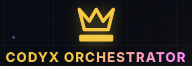
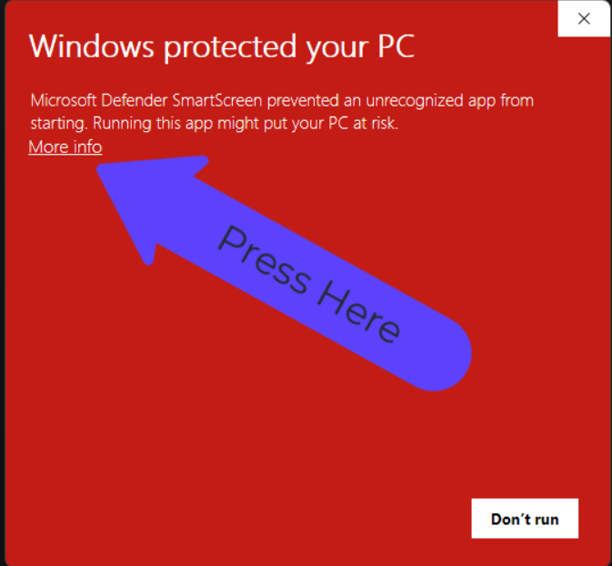
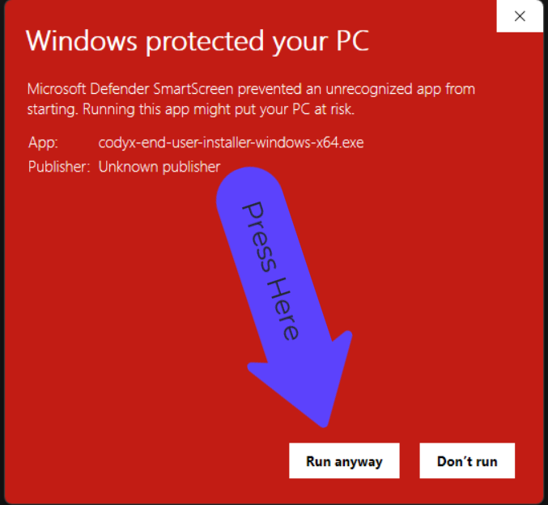
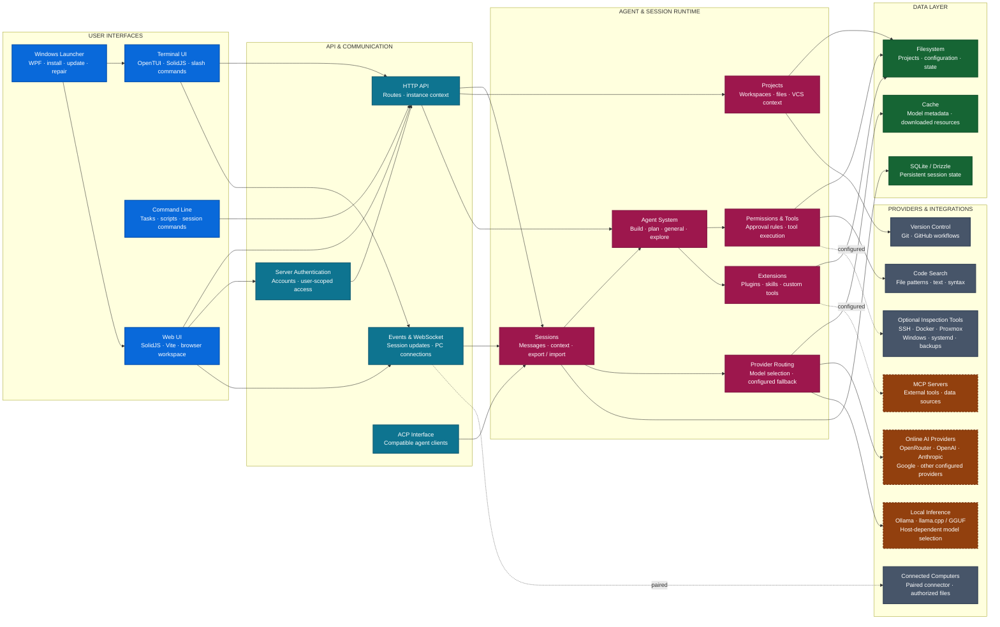

<p align="center">
  <a href="https://install.kingkung.men/downloads"></a>
</p>

<h1 align="center">Codyx-Orchestrator</h1>
<h3 align="center">A multi-agent assistant for your projects</h3>
<p align="center">Code, explore, and automate with local or online models.<br>Choose a terminal workspace or a browser-based Web UI.</p>
<p align="center"><sub>Built by M. Farid (Mufasa)</sub></p>

<p align="center">
  <a href="https://install.kingkung.men/downloads"></a>
  <a href="docs/USER_GUIDE.md"></a>
  <a href="https://install.kingkung.men/feedback"></a>
</p>

<p align="center">
  <a href="https://github.com/mufasa1611/codyx-orchestrator/releases"></a>
  <a href="https://github.com/mufasa1611/codyx-orchestrator/releases/latest"></a>
  <a href="LICENSE"></a>
</p>

<p align="center">
  <a href="#get-started">Get started</a> &middot;
  <a href="#your-workspaces">Workspaces</a> &middot;
  <a href="#models-and-providers">Models</a> &middot;
  <a href="#agents-and-tools">Agents</a> &middot;
  <a href="#updates-and-repair">Updates</a> &middot;
  <a href="#help-and-feedback">Help</a>
</p>

---

## Why Codyx?

**Choose your interface, your model, and how much control to give your agents.**

| Your priority | What Codyx brings |
| :--- | :--- |
| **A familiar workspace** | Terminal, command line, and Web UI, with external terminal and browser actions in the Windows launcher. |
| **Model flexibility** | Online providers alongside Ollama and llama.cpp; local recommendations based on the host computer. |
| **More than chat** | Agents that can plan, explore a project, and use permitted tools to carry out work. |
| **Continuity** | Project context, session history, task progress, and export/import tools. |
| **Personal or shared use** | A local terminal profile or an authenticated multi-user Web UI deployment. |
| **Room to extend** | Custom agents, skills, plugins, local tools, MCP, and ACP integrations. |

### Find Your Way

| Start here | Work with Codyx | Go deeper |
| :--- | :--- | :--- |
| [Install](#get-started) | [CLI commands](#cli-commands) | [Architecture](#architecture) |
| [SmartScreen guide](#windows-smartscreen-bypass-guide) | [TUI slash commands](#tui-chat-slash-commands) | [Environment variables](#environment-variables) |
| [Models](#models-and-providers) | [Multi-user server](#multi-user-server) | [Ecosystem](#ecosystem) |
| [Updates](#updates-and-repair) | [Agents and tools](#agents-and-tools) | [Privacy](#private-by-default) |

## Get Started

**New to Codyx? Start with the Windows launcher.** It installs compiled application files without requiring a source checkout, Git, or a separate Bun installation.

| Download | Choose this when |
| :--- | :--- |
| **[Windows launcher](https://install.kingkung.men/downloads/windows)** | You want the newest available launcher. This can be a Beta. |
| [Stable channel](https://install.kingkung.men/downloads/windows?channel=stable) | You want the current stable release. |
| [Beta channel](https://install.kingkung.men/downloads/windows?channel=beta) | You want to try prerelease improvements. |
| [All platforms and assets](https://github.com/mufasa1611/codyx-orchestrator/releases) | You need a specific version, architecture, or CLI archive. |

### Your First Launch

1. Open **`codyx-installer-launcher-windows-x64.exe`**.
2. Choose **Stable** or **Beta**, review the license, and start installation.
3. Enter your display name and email, then enter the verification code sent to you.
4. In **rc9 Beta**, choose **Connect OpenRouter in browser**, sign in and approve the connection. Or choose a local model. Codyx tests chat and agent tools before reporting readiness.
5. Open the **Terminal** or **Web UI** workspace and select your project.

You do not need a GitHub account or GitHub token to download or update public releases.

> [!TIP]
> **Already installed? Keep your existing installation.** Close active jobs and use the launcher's update action. If an older launcher cannot upgrade, run the newest installer once. You do not need to uninstall first.

> [!IMPORTANT]
> Download the explicitly named **installer** or **CLI** asset. GitHub's automatic **Source code** archives contain public documentation, not the application. The older `codyx-launcher-windows-x64.exe` is a different, source-based launcher; it is not the recommended installer.

### Windows SmartScreen Bypass Guide

**For a download you have verified and trust, not a reason to ignore a security warning.** SmartScreen can warn when a downloaded application has insufficient reputation. See [Microsoft's explanation](https://learn.microsoft.com/en-us/windows/apps/package-and-deploy/smartscreen-reputation).

1. Download from the [official download page](https://install.kingkung.men/downloads) or this repository's named release assets.
2. Check that the filename is `codyx-installer-launcher-windows-x64.exe`. Compare its SHA256 with the `installer.windows-x64` entry in the **same release's** `codyx-release-manifest.json`.
3. If Windows displays an **unrecognized app** warning and you trust the verified download, select **More info**, inspect the application details, then choose **Run anyway** if that option is available.
4. If Windows reports a specific malware detection, the hash differs, or your organization's policy blocks execution, stop and contact support or your administrator. Do not disable Defender, SmartScreen, or Smart App Control.

<details>
<summary><strong>Show the two illustrated steps and checksum command</strong></summary>

<p align="center">
  
  
</p>

These are older illustrative screenshots; their filename and colors can differ from the current installer and your Windows version. Always check the actual file you downloaded.

```powershell
Get-FileHash "$env:USERPROFILE\Downloads\codyx-installer-launcher-windows-x64.exe" -Algorithm SHA256
```

A matching checksum confirms the file matches the published asset; it is not a guarantee that software is harmless.

</details>

## What You Can Do

| Work | How Codyx helps |
| :--- | :--- |
| **Understand a project** | Explore files, trace behavior, and ask questions with project context. |
| **Plan and implement** | Discuss a change, use agents and tools, then review the result. |
| **Keep work organized** | Switch projects, resume sessions, and track task progress. |
| **Choose your models** | Use configured online providers or a local model that fits your computer. |
| **Automate repeatable tasks** | Use CLI prompts, session exports, and tool integrations. |
| **Extend your workflow** | Configure agents, skills, plugins, custom tools, and MCP connections. |

Tools run with the permissions and access you grant. Review proposed commands and changes, especially on important projects or remote computers.

## Your Workspaces

### Terminal

The TUI is an interactive terminal workspace with model and agent selection, session history, themes, and slash commands. The local terminal normally uses your local profile and projects.

```bash
codyx
```

### Web UI

Use the browser-based workspace for projects, sessions, model selection, and connected computers. The launcher can host it inside its window or open it using **Open in browser**.

```bash
codyx web
```

An authenticated Web UI account has its own session scope. A hosted server's history is not automatically the same as your local TUI history. Keep the launcher open while using the local Web server it started.

### Command Line

Run a focused task without entering the full-screen interface. The launcher's **Open CMD terminal** action opens a separate command window on Windows.

```bash
codyx run "Explain this project's structure. Do not change any files."
```

**Connecting a computer:** use **Connect PC** in the Web UI and follow the instructions for that server. For a remote server, run the displayed connector command on the computer you want to connect. Use a fresh pairing code from the same server. See [accounts, history, and PC connections](docs/USER_GUIDE.md#accounts-history-and-connected-computers).

## Multi-User Server

**One hosted Web UI, separate user accounts and session histories.** A shared deployment lets users work through their browser while the server runs the application backend.

| Capability | What it means |
| :--- | :--- |
| **Account sign-in** | Users authenticate to the selected Web UI server. |
| **User-scoped history** | Sessions belong to the account and server context, not a shared local TUI profile. |
| **Connected computers** | Pair an authorized PC to that server to access its available drives and project files. |
| **Server administration** | Hosted update installation is restricted to the configured update administrator. |
| **Persistent operation** | The operator manages storage, backups, service availability, and access controls. |

The CLI exposes a headless server entry point:

```bash
codyx serve --hostname 127.0.0.1 --port 4097
```

This command alone does **not** configure a secure multi-user deployment. A public deployment needs server-mode authentication, TLS, account isolation, permissions, persistent data, and backups. Keep an unconfigured instance on loopback. A server's local model runs on the server, not automatically on every connected user's PC.

[Accounts, session history, and PC connections](docs/USER_GUIDE.md#accounts-history-and-connected-computers)

## Models and Providers

**Choose where inference runs.** A local model uses your computer; an online model sends requests to its provider. Changing providers does not make their pricing or privacy policies identical.

| Option | What to expect |
| :--- | :--- |
| **Ollama** | Local model management and inference. Setup detects installed engines and presents model choices. |
| **llama.cpp / GGUF** | Local inference with compatible GGUF model files and a configured engine. |
| **Online providers** | Integrations include OpenRouter, OpenAI, Anthropic, Google, and others available in your build. Authentication may be required. |
| **Compatible endpoints** | Advanced users can configure supported OpenAI-compatible services, including local endpoints. |

```bash
codyx setup models
codyx models
```

Local recommendations consider available hardware; there is no single best local model for every PC. Memory, GPU capacity, model size, context length, and tool support all affect the experience.

**Windows rc9 Beta:** open **Model connections** in the launcher. **Find installed models** discovers existing Ollama models, running llama.cpp models and GGUF files in common folders. Choose and test one, or browse to an existing GGUF. **Set up Ollama** and **Set up llama.cpp** offer fitting downloads when needed. Existing engines and model files are reused.

The standard OpenRouter order is North Mini Code Free, Laguna S Free, Dots3 Note Free, Nemotron 3 Ultra Free, then OpenRouter Free Router. Space Bunny is no longer the default because it is absent from the current catalog. Your own OpenRouter account is required; no shared API key is bundled.

> [!NOTE]
> Free online models can change, become unavailable, or reach provider quotas. Codyx does not promise unlimited free access. Configured fallback can try another eligible provider or a ready local model, but the local engine and model must actually be available. Review fallback choices if you want local-only processing.

[Model setup and troubleshooting](docs/USER_GUIDE.md#models-and-local-engines)

## Agents and Tools

Different agents can handle planning, implementation, and exploration. Built-in roles include:

| Agent | Role |
| :--- | :--- |
| `build` | Main working agent; uses tools according to configured permissions. |
| `plan` | Planning-focused mode with edit tools disabled. |
| `general` | Subagent for multi-step work and research within its available tools. |
| `explore` | Subagent for locating files and understanding code. |

Custom profiles can add specialist workflows such as infrastructure inspection or web research. These require their own tools and configuration; not every profile from a development checkout is bundled in every release.

Use `/agents` in the TUI or `codyx agent list` to see what is actually available. [Agent and extension guide](docs/USER_GUIDE.md#agents-permissions-and-extensions)

## CLI Commands

Run commands in a terminal. Use `codyx --help` or add `--help` to a command for your installed version's options.

| Command | Purpose |
| :--- | :--- |
| `codyx` | Open the interactive TUI. |
| `codyx run "your task"` | Run a one-shot prompt or task. |
| `codyx web` | Start the local Web UI. |
| `codyx serve` | Start a headless HTTP server. |
| `codyx setup` | Open the setup wizard. |
| `codyx setup models` | Select a provider and model preset. |
| `codyx models` | List available model IDs. |
| `codyx providers login` | Connect an AI provider. |
| `codyx agent list` / `codyx agent create` | Inspect or create agents. |
| `codyx session list` | List sessions for the current instance. |
| `codyx -s SESSION_ID` | Resume an existing session. |
| `codyx doctor` | Diagnose installation and environment problems. |

<details>
<summary><strong>More CLI commands: exports, integrations, and maintenance</strong></summary>

| Command | Purpose |
| :--- | :--- |
| `codyx export SESSION_ID` | Export session JSON to standard output; inspect it for private content before sharing. |
| `codyx import session.json` | Import a session file. |
| `codyx stats` | Inspect recorded local usage. |
| `codyx mcp --help` | Configure MCP server integrations. |
| `codyx acp --help` | Inspect Agent Client Protocol options. |
| `codyx plugin --help` / `codyx plugins` | Install plugins or inspect their health. |
| `codyx users --help` | Inspect server account management commands. |
| `codyx github --help` / `codyx pr --help` | Inspect GitHub and pull-request workflows. |
| `codyx debug --help` | Inspect diagnostic tools. |
| `codyx upgrade --help` | Review update options; managed Windows installs should normally use the launcher. |
| `codyx uninstall --help` | Review removal options before uninstalling. |

</details>

```bash
codyx run --agent plan "Plan the changes needed to add settings validation."
```

## TUI Chat Slash Commands

Type `/` **inside the TUI chat prompt**, not in CMD or PowerShell. Available entries can depend on the current session and integrations.

| Command | Action |
| :--- | :--- |
| `/sessions` | Browse history; aliases: `/resume`, `/continue`. |
| `/new` | Start a new session without deleting old history; alias: `/clear`. |
| `/models` | Choose an AI model. |
| `/agents` | Choose an agent. |
| `/connect` | Connect an AI provider; this is not Web UI **Connect PC**. |
| `/mcps` | Manage enabled MCP connections. |
| `/variants` | Choose a supported model variant. |
| `/permissions` | Select Restricted, Standard, or Full permission mode. |
| `/status` | View connection and system status. |
| `/themes` | Change the terminal theme. |
| `/help` | Open the terminal help overlay. |
| `/exit` | Exit Codyx; aliases: `/quit`, `/q`. |

## Architecture

**From interfaces to agents, storage, and integrations.** The connected layers below show the application's logical structure, not a particular user's machine or hosted deployment.


```mermaid
flowchart LR
    classDef interface fill:#0969da,color:#fff,stroke:#0550ae,stroke-width:2px
    classDef gateway fill:#0e7490,color:#fff,stroke:#155e75,stroke-width:2px
    classDef core fill:#9d174d,color:#fff,stroke:#831843,stroke-width:2px
    classDef data fill:#166534,color:#fff,stroke:#14532d,stroke-width:2px
    classDef external fill:#92400e,color:#fff,stroke:#78350f,stroke-width:2px,stroke-dasharray:5 3
    classDef tools fill:#475569,color:#fff,stroke:#334155,stroke-width:2px

    subgraph Interfaces ["USER INTERFACES"]
        LAUNCH["Windows Launcher<br/>WPF · install · update · repair"]:::interface
        TUI["Terminal UI<br/>OpenTUI · SolidJS · slash commands"]:::interface
        CLI["Command Line<br/>Tasks · scripts · session commands"]:::interface
        WEB["Web UI<br/>SolidJS · Vite · browser workspace"]:::interface
    end

    subgraph Gateway ["API & COMMUNICATION"]
        HTTP["HTTP API<br/>Routes · instance context"]:::gateway
        AUTH["Server Authentication<br/>Accounts · user-scoped access"]:::gateway
        WS["Events & WebSocket<br/>Session updates · PC connections"]:::gateway
        ACP["ACP Interface<br/>Compatible agent clients"]:::gateway
    end

    subgraph Engine ["AGENT & SESSION RUNTIME"]
        SESS["Sessions<br/>Messages · context · export / import"]:::core
        PROJ["Projects<br/>Workspaces · files · VCS context"]:::core
        AGT["Agent System<br/>Build · plan · general · explore"]:::core
        PERM["Permissions & Tools<br/>Approval rules · tool execution"]:::core
        PROV["Provider Routing<br/>Model selection · configured fallback"]:::core
        PLG["Extensions<br/>Plugins · skills · custom tools"]:::core
    end

    subgraph Data ["DATA LAYER"]
        DB["SQLite / Drizzle<br/>Persistent session state"]:::data
        FS["Filesystem<br/>Projects · configuration · state"]:::data
        CACHE["Cache<br/>Model metadata · downloaded resources"]:::data
    end

    subgraph External ["PROVIDERS & INTEGRATIONS"]
        CLOUD["Online AI Providers<br/>OpenRouter · OpenAI · Anthropic<br/>Google · other configured providers"]:::external
        LOCAL["Local Inference<br/>Ollama · llama.cpp / GGUF<br/>Host-dependent model selection"]:::external
        MCP["MCP Servers<br/>External tools · data sources"]:::external
        PC["Connected Computers<br/>Paired connector · authorized files"]:::tools
        VCS["Version Control<br/>Git · GitHub workflows"]:::tools
        SEARCH["Code Search<br/>File patterns · text · syntax"]:::tools
        INFRA["Optional Inspection Tools<br/>SSH · Docker · Proxmox<br/>Windows · systemd · backups"]:::tools
    end

    LAUNCH --> TUI & WEB
    TUI & CLI & WEB --> HTTP
    WEB --> AUTH
    TUI & WEB --> WS
    AUTH --> HTTP
    HTTP --> SESS & PROJ & AGT
    ACP --> SESS
    WS --> SESS
    SESS --> AGT & PROV
    AGT --> PERM & PLG
    PROJ --> FS & VCS
    SESS --> DB
    PROV --> CACHE
    PLG --> FS
    PERM --> FS & SEARCH
    PROV --> CLOUD & LOCAL
    PLG -. configured .-> MCP
    PERM -. configured .-> INFRA
    WS -. paired .-> PC
```

Solid arrows show the main logical connections. Dashed arrows mark configured or paired integrations. Online services, local engines, and optional tools require their own setup and permissions. Use the diagram's expand and zoom controls for a closer view.

| Layer | Technology and responsibility |
| :--- | :--- |
| **Windows launcher** | .NET/WPF shell, embedded browser/terminal, setup and updates. |
| **Terminal UI** | SolidJS-based OpenTUI interface. |
| **Web UI** | SolidJS and Vite browser application. |
| **Runtime** | TypeScript/Bun with Effect-based application services. |
| **API and events** | HTTP routes and WebSocket communication. |
| **Persistence** | SQLite via Drizzle, plus configuration and project files. |
| **Interoperability** | MCP tools, ACP clients, provider adapters, and plugins. |

The compiled Windows installer packages the runtime components it needs. Users do not need to build the development project.

## Environment Variables

**Advanced configuration:** the launcher normally sets its own installation paths. Change these only for a specific purpose; a different configuration or data directory can make models or history appear missing.

| Variable | Purpose |
| :--- | :--- |
| `CODY_CONFIG_DIR` | Select an additional configuration directory; managed installations set this to their generated configuration. |
| `CODY_REFRESH_MODELS=1` | Request fresh discovery through the local discovery/launcher path. |
| `CODY_SKIP_MODEL_DISCOVERY=1` | Skip discovery in paths that support local discovery. |
| `XDG_DATA_HOME` | Change the user data root. Back up and plan migration before changing it. |
| `CODY_DISABLE_AUTOUPDATE=1` | Disable the CLI's built-in update check; does not disable every launcher update mechanism. |

<details>
<summary><strong>Infrastructure integration settings</strong></summary>

Custom Proxmox inspection tools may use `CODY_PROXMOX_URL`, `CODY_PROXMOX_TOKEN_ID`, and `CODY_PROXMOX_TOKEN_SECRET`. These apply only when the corresponding tool is installed and configured. Use a least-privilege account and keep actual credentials outside public files and logs.

</details>

[Configuration examples and discovery instructions](docs/USER_GUIDE.md#configuration)

## Ecosystem

The wider project contains several components. **A component in the development project is not automatically a separately published product.** Check release assets for what is available to install.

| Component | Role |
| :--- | :--- |
| **Codyx CLI / TUI / server** | Main application, sessions, agents, and provider connections. |
| **Windows installer / launcher** | First-run verification, compiled installation, workspace shell, and release-channel updates. |
| **Web application** | Browser-based projects, sessions, accounts, and PC connections. |
| **Shared core and UI** | Common application services and interface components. |
| **Plugin system and JavaScript SDK** | Extension and integration surfaces. |
| **Electron desktop wrapper** | Separate desktop packaging work; not the WPF Windows installer. |
| **Slack integration and editor SDK** | Additional integration components whose availability depends on the distribution. |
| **Android and container work** | Platform/deployment components; use only explicitly published and supported packages. |

Development source is private. Public documentation and compiled downloads remain available here without source-repository credentials.

## Updates and Repair

- **Keep your channel:** Stable and Beta are separate choices. A new Beta does not replace the Stable release.
- **Check manually:** use the launcher's update action when you want to check immediately.
- **Repair a problem:** use its repair action when available, or run `codyx doctor` for diagnostics.
- **Keep your work:** finish active jobs before updating; back up important configuration and sessions.
- **Older installations:** follow the [migration guide](MIGRATION.md) if the launcher or a Git-based installation cannot update.

Supported launcher update paths check release-manifest hashes and can replace the installed launcher. Very old launchers may need a one-time download of the current installer. Git checkouts of the old source cannot update into this documentation repository.

## Platform Availability

| Platform | Public distribution |
| :--- | :--- |
| **Windows** | Compiled x64 installer/launcher; CLI archives for published Windows targets. |
| **Linux** | CLI archives for published x64/ARM64 and libc variants. |
| **macOS** | CLI archives for published Apple Silicon and Intel targets. |
| **Android** | Use only an APK explicitly listed on the download page or in a release. Otherwise, use a supported browser connection to a Web UI server. |

The Windows launcher is not a Linux, macOS, or Android application. Check the assets for your chosen release; a platform's presence in the development project does not guarantee a published installer.

## Private by Default

**Control starts with understanding where your work runs.** This does not mean every default model is local or that the application never makes network requests.

| Area | Privacy boundary |
| :--- | :--- |
| **Local model inference** | Runs on the configured host; review fallback and tool settings for network access. |
| **Online inference** | Sends the required prompt and context to the selected provider under its policies. |
| **Local sessions** | Stored by the local application instance. |
| **Hosted Web UI** | Uses the server's storage and account controls; trust the server operator. |
| **Installer verification** | Uses the display name, email, and operational registration information described in the privacy notice. |
| **Plugins and connected PCs** | Introduce additional access and data flows according to their configuration and permissions. |

**Local and online models have different data boundaries.** Online providers receive the context sent to them. Network tools, plugins, connected computers, and hosted servers introduce their own data flows, even when the selected model is local.

The Windows installer requests a display name and email verification. Read the [privacy notice](https://install.kingkung.men/privacy) for registration data, service operation, and contact details. Do not put API keys, verification codes, private transcripts, or personal system details in public issues.

This repository contains **public documentation, compiled releases, and update manifests**. Development source and its history are maintained privately. End users do not need access to that repository.

## Explore the Guide

| Reference | Find out about |
| :--- | :--- |
| [Everyday commands](docs/USER_GUIDE.md#command-reference) | Setup, models, agents, sessions, exports, and diagnostics. |
| [TUI slash commands](docs/USER_GUIDE.md#tui-slash-commands) | Sessions, providers, permissions, themes, and help. |
| [Configuration](docs/USER_GUIDE.md#configuration) | Project settings, permissions, and model discovery. |
| [How it fits together](docs/USER_GUIDE.md#how-it-fits-together) | Interfaces, tools, model providers, and storage. |
| [Troubleshooting](docs/USER_GUIDE.md#troubleshooting) | Slow models, missing history, pairing, and updates. |

## Help and Feedback

[Installer website](https://install.kingkung.men/) &middot; [Feedback](https://install.kingkung.men/feedback) &middot; [GitHub issues](https://github.com/mufasa1611/codyx-orchestrator/issues) &middot; [Privacy](https://install.kingkung.men/privacy) &middot; [Security reporting](SECURITY.md)

For a bug report, include your Codyx version, operating system, release channel, and steps to reproduce. Remove personal data and secrets from logs and screenshots. Public documentation improvements and clear feature requests are welcome.

<details>
<summary><strong>Acknowledgements and license</strong></summary>

Built by **M. Farid (Mufasa)**, with thanks to the upstream projects and open-source maintainers whose work supports Codyx.

The project's acknowledgements include [James Long](https://github.com/jlongster), [Brendan Allan](https://github.com/Brendonovich), [David Hill](https://github.com/iamdavidhill), [Adam](https://github.com/adamdotdevin), [Aiden Cline](https://github.com/rekram1-node), [Kit Langton](https://github.com/kitlangton), [Frank](https://github.com/fwang), [Jay](https://github.com/jayair), and [Dax](https://github.com/thdxr).

See the [MIT license](LICENSE) and [installer license page](https://install.kingkung.men/license). Preserve the copyright and third-party notices included with downloaded software.

</details>
